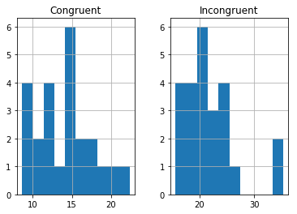

## 优达学城DAND（进阶）P1-检验心理学项目
### 统计学：检验心理学现象

背景信息

在一个Stroop （斯特鲁普）任务中，参与者得到了一列文字，每个文字都用一种油墨颜色展示。参与者的任务是将文字的打印颜色大声说出来。这项任务有两个条件：一致文字条件，和不一致文字条件。在一致文字条件中，显示的文字是与它们的打印颜色匹配的颜色词，如“红色”、“蓝色”。在不一致文字条件中，显示的文字是与它们的打印颜色不匹配的颜色词，如“紫色”、“橙色”。在每个情况中，我们将计量说出同等大小的列表中的墨色名称的时间。每位参与者必须全部完成并记录每种条件下使用的时间。

调查问题


(1) 我们的自变量是什么？因变量是什么？

**自变量**：文字意义和显示的颜色是否一一致  

**因变量**：说出同等大小的列表中的墨色名称的时间

(2) 此任务的适当假设集是什么？你需要以文字和数学符号方式对假设集中的零假设和对立假设加以说明，并对数学符号进行定义。你想执行什么类型的统计检验？为你的选择提供正当理由（比如，为何该实验满足你所选统计检验的前置条件）。

-----------

假设一致文字条件和不一致文字条件下，说出正确墨色名称所需时间两个总体平均值是否具有差异。

time<sub>1</sub>:一致文字条件下，说出正确墨色名称所需时间时间的总体平均值。

time<sub>0</sub>:不一致文字条件，说出正确墨色名称所需时间时间的总体平均值。
- 原假设：即一致文字条件和不一致文字条件下，说出正确墨色名称所需时间相等，H<sub>0</sub>: time<sub>1</sub> = time<sub>0</sub>。

- 原假设：即一致文字条件和不一致文字条件下，说出正确墨色名称所需时间不相等，H<sub>1</sub>: time<sub>1</sub> ≠ time<sub>0</sub>。

stoop任务是每个人分别对一致/不一致文字条件下的识别，且不同人之间的测试认为是相互独立的。因此得到的两样本具有相关性，检验两个相关总体的均值之差是否等于0，执行配对t检验的方法。

--------

现在轮到你自行尝试 Stroop 任务了。前往此链接，其中包含一个基于 Java 的小程序，专门用于执行 Stroop 任务。记录你收到的任务时间（你无需将时间提交到网站）。现在下载此数据集，其中包含一些任务参与者的结果。数据集的每行包含一名参与者的表现，第一个数字代表他们的一致任务结果，第二个数字代表不一致任务结果。

(3) 报告关于此数据集的一些描述性统计。包含至少一个集中趋势测量和至少一个变异测量。


```python
from scipy import stats
import numpy as np
import pandas as pd
import matplotlib.pyplot as plt
%matplotlib inline
```


```python
df = pd.read_csv('stroopdata.csv')
df.head()
```


<div>
<style scoped>
    .dataframe tbody tr th:only-of-type {
        vertical-align: middle;
    }

    .dataframe tbody tr th {
        vertical-align: top;
    }

    .dataframe thead th {
        text-align: right;
    }
</style>
<table border="1" class="dataframe">
  <thead>
    <tr style="text-align: right;">
      <th></th>
      <th>Congruent</th>
      <th>Incongruent</th>
    </tr>
  </thead>
  <tbody>
    <tr>
      <th>0</th>
      <td>12.079</td>
      <td>19.278</td>
    </tr>
    <tr>
      <th>1</th>
      <td>16.791</td>
      <td>18.741</td>
    </tr>
    <tr>
      <th>2</th>
      <td>9.564</td>
      <td>21.214</td>
    </tr>
    <tr>
      <th>3</th>
      <td>8.630</td>
      <td>15.687</td>
    </tr>
    <tr>
      <th>4</th>
      <td>14.669</td>
      <td>22.803</td>
    </tr>
  </tbody>
</table>
</div>


```python
df.describe()
```


<div>
<style scoped>
    .dataframe tbody tr th:only-of-type {
        vertical-align: middle;
    }

    .dataframe tbody tr th {
        vertical-align: top;
    }

    .dataframe thead th {
        text-align: right;
    }
</style>
<table border="1" class="dataframe">
  <thead>
    <tr style="text-align: right;">
      <th></th>
      <th>Congruent</th>
      <th>Incongruent</th>
    </tr>
  </thead>
  <tbody>
    <tr>
      <th>count</th>
      <td>24.000000</td>
      <td>24.000000</td>
    </tr>
    <tr>
      <th>mean</th>
      <td>14.051125</td>
      <td>22.015917</td>
    </tr>
    <tr>
      <th>std</th>
      <td>3.559358</td>
      <td>4.797057</td>
    </tr>
    <tr>
      <th>min</th>
      <td>8.630000</td>
      <td>15.687000</td>
    </tr>
    <tr>
      <th>25%</th>
      <td>11.895250</td>
      <td>18.716750</td>
    </tr>
    <tr>
      <th>50%</th>
      <td>14.356500</td>
      <td>21.017500</td>
    </tr>
    <tr>
      <th>75%</th>
      <td>16.200750</td>
      <td>24.051500</td>
    </tr>
    <tr>
      <th>max</th>
      <td>22.328000</td>
      <td>35.255000</td>
    </tr>
  </tbody>
</table>
</div>


```python
print("测试者数量为24对 ，其中：")
print("一致性/不一致条件下样本的答对时间均值分别为:",14.05 ,22.02)  
print("一致性/不一致条件下样本的答对时间标准差分别为:",3.56 , 4.80)  
print("一致性/不一致条件下样本的答对时间最小值分别为:",8.63,15.68)  
print("一致性/不一致条件下样本的答对时间最大值分别为:",22.32,35.26)  
```

    测试者数量为24对 ，其中：
    一致性/不一致条件下样本的答对时间均值分别为: 14.05 22.02
    一致性/不一致条件下样本的答对时间标准差分别为: 3.56 4.8
    一致性/不一致条件下样本的答对时间最小值分别为: 8.63 15.68
    一致性/不一致条件下样本的答对时间最大值分别为: 22.32 35.26
    

(4) 提供显示样本数据分布的一个或两个可视化。用一两句话说明你从图中观察到的结果。


```python
df.hist();
```





**一致条件下，答对时间分布在15s左右，不一致条件下，答对时间分布在21s左右，两者存在较明显差异。**

(5) 现在，执行统计测试并报告你的结果。你的置信水平和关键统计值是多少？你是否成功拒绝零假设？对试验任务得出一个结论。结果是否与你的期望一致？


```python
#置信水平为95%

#自由度：df=n-1=23

#样本均值差异：d=22.015917-14.051125=7.9648  

#标准差：s
s=(df.Congruent-df.Incongruent).std()
s
```


    4.864826910359056


```python
#计算t检验分位数
#t=d/(sqrt(s^2/n))  
t=7.9648/np.sqrt(s**2/(24))
t
```


    8.020715335945845


经查表 df=23，置信水平95%下t临界值为2.069<8.02，因此根据结论在显著性水平为 0.05 的情况下，拒绝零假设 H<sub>0</sub>，即两样本的总体均值不相等，与可视化的观察一致。

[参考资料](https://blog.csdn.net/m0_37777649/article/details/74938120)
